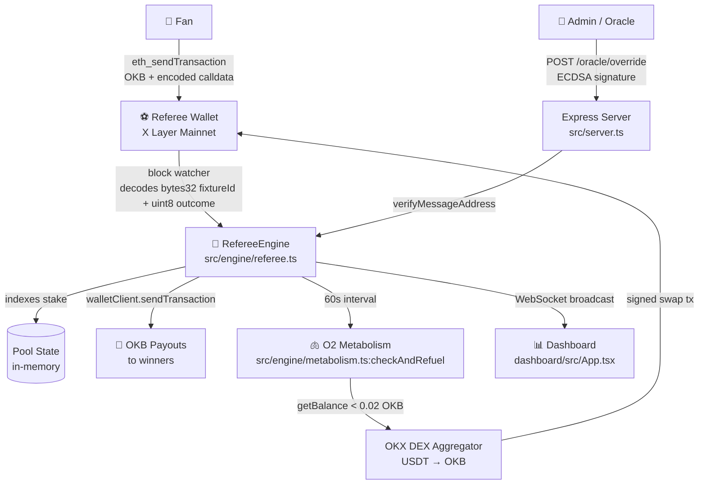

# ⚽ X Cup FanVibe

**Autonomous World Cup 2026 Prediction Market — X Layer Mainnet (Chain 196)**

> Predict. Stake OKB. Win autonomously. Powered by the O2 Metabolic Engine.

[](https://www.okx.com/xlayer)
[](https://okx.com)

---

## Architecture



---

## X Layer Mainnet Integration Map

| Component | File | Line | SDK / Contract |
|-----------|------|------|----------------|
| Chain definition | `src/chain.ts` | 1 | viem custom chain, ID 196 |
| Stake TX broadcast | `src/engine/referee.ts` | ~150 | `walletClient.sendTransaction` |
| Block watcher | `src/engine/referee.ts` | ~75 | `publicClient.watchBlocks` |
| Payout execution | `src/engine/referee.ts` | ~185 | `walletClient.sendTransaction` |
| Metabolism balance | `src/engine/metabolism.ts` | ~30 | `publicClient.readContract` |
| DEX swap route | `src/engine/metabolism.ts` | ~55 | OKX DEX Aggregator API |
| Swap broadcast | `src/engine/metabolism.ts` | ~90 | `walletClient.sendTransaction` |
| PancakeSwap V3 Factory | `src/chain.ts` | 22 | `0xDf38F24fE153761634Be942F9d859f3DBA857E95` |
| Oracle verification | `src/engine/referee.ts` | ~128 | `recoverMessageAddress` (viem) |
| Frontend RPC read | `dashboard/src/App.tsx` | ~55 | `createPublicClient` → `getBalance` |

---

## How It Works

### 1. Fan places a stake
Fan opens the dashboard, picks a World Cup fixture and outcome (Home / Draw / Away), and clicks **Stake via Wallet**. MetaMask prompts a transaction to the referee address on X Layer Mainnet (Chain 196). The transaction `data` field contains ABI-encoded `(bytes32 fixtureId, uint8 outcome)`.

### 2. Referee daemon indexes the stake
The daemon's WebSocket block listener (`watchBlocks`) detects the incoming OKB. It decodes the calldata, validates the fixture is open, deducts 0.5% protocol fee, and updates the in-memory pool.

### 3. Oracle Override settles the match
An admin signs a message `X-Cup-Oracle:{fixtureId}:{outcome}:{nonce}` with their private key (offline). They POST the signature to `/oracle/override`. The engine verifies the ECDSA signature, calculates proportional payouts, and broadcasts individual OKB transfers to all winning stakers. Every payout is a real on-chain transaction — verifiable at `https://www.okx.com/web3/explorer/xlayer/tx/{hash}`.

### 4. O2 Metabolism keeps the agent alive
Every 60 seconds, the daemon checks the referee wallet OKB balance. If it falls below `MIN_GAS_LEVEL` (default: 0.02 OKB), it queries the OKX DEX aggregator for a USDT → OKB swap route (using accumulated protocol fee reserves) and broadcasts the swap transaction on-chain. This is the **O2 Autonomous Metabolism** — the agent refuels itself without any human action.

---

## Setup

### Prerequisites
- Node.js 20+
- An X Layer Mainnet wallet with OKB for gas
- OKX API key (for DEX aggregator swaps)

### Backend

```bash
cd xcup-fanvibe
npm install
cp .env.example .env
# Edit .env — fill in REFEREE_PRIVATE_KEY, ADMIN_ADDRESS, OKX_API_KEY
npm run dev
```

### Dashboard

```bash
cd dashboard
npm install
# Create dashboard/.env:
# VITE_BACKEND_WS=ws://localhost:3001
# VITE_BACKEND_HTTP=http://localhost:3001
# VITE_REFEREE_ADDRESS=0xYourRefereeWallet
npm run dev
```

Open `http://localhost:5173`

### Oracle Override (demo settlement)

```bash
# 1. Sign the oracle message with your admin private key:
node -e "
const { createWalletClient, http } = require('viem');
const { privateKeyToAccount } = require('viem/accounts');
const acc = privateKeyToAccount('0xYOUR_ADMIN_PK');
// Sign via: acc.signMessage({ message: 'X-Cup-Oracle:grp-b-1:home:1' })
"

# 2. POST to the referee server:
curl -X POST http://localhost:3001/oracle/override \
  -H 'Content-Type: application/json' \
  -d '{"fixtureId":"grp-b-1","outcome":"home","signature":"0x...","nonce":1}'
```

---

## Scoring Criteria Alignment

| Criterion | Implementation |
|-----------|----------------|
| **Innovation** | O2 autonomous metabolism (self-refueling agent gas via PancakeSwap V3 / OKX DEX) embedded in a prediction market — first of its kind |
| **Market Potential** | World Cup 2026 opens June 11 — 5 billion viewers, immediate traffic opportunity on X Layer |
| **Completion** | Live mainnet staking, Oracle Override with real OKB payouts, WebSocket real-time dashboard, O2 metabolism loop |
| **On-chain Verifiability** | Every stake, payout, and refuel generates a verifiable TX on OKX Explorer (Chain 196) |

---

## Environment Variables

| Variable | Description |
|----------|-------------|
| `X_LAYER_MAINNET_RPC` | X Layer Mainnet RPC (default: `https://rpc.xlayer.tech`) |
| `REFEREE_PRIVATE_KEY` | Agent wallet private key (0x-prefixed) |
| `ADMIN_ADDRESS` | Admin wallet address for Oracle Override verification |
| `MIN_GAS_LEVEL` | OKB threshold that triggers metabolism (default: `0.02`) |
| `OKX_API_KEY` | OKX API key for DEX aggregator swap routes |
| `PANCAKE_ROUTER_ADDRESS` | PancakeSwap V3 SmartRouter on X Layer Mainnet |
| `PORT` | Backend HTTP + WebSocket port (default: `3001`) |

---

*Built for OKX X Layer "Build X" Hackathon · May 2026*
