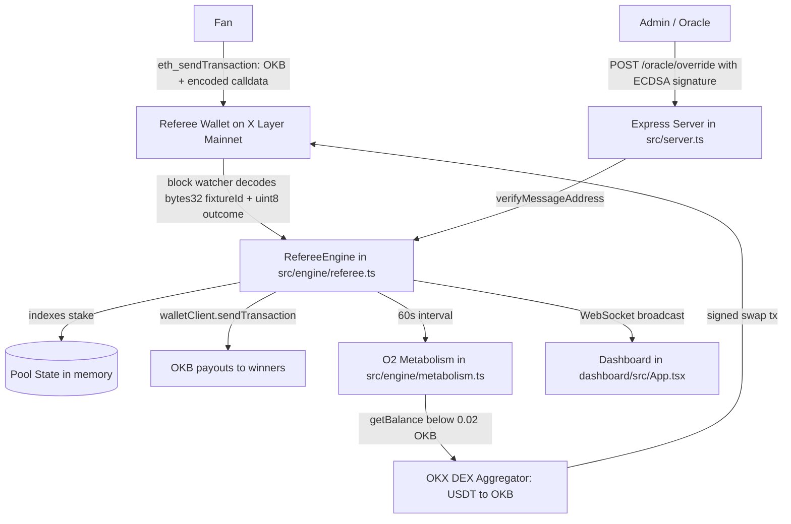

# X Cup FanVibe

**Autonomous World Cup 2026 prediction market on X Layer Mainnet (Chain 196).**

Predict match outcomes, stake OKB, and settle pools through an autonomous referee engine powered by the O2 Metabolic Engine.

[](https://www.okx.com/xlayer)
[](https://okx.com)

---

## Architecture



---

## X Layer Mainnet Integration Map

| Component | File | SDK / Contract |
|-----------|------|----------------|
| Chain definition | `src/chain.ts` | viem custom chain, ID 196 |
| Stake TX broadcast | `src/engine/referee.ts` | `walletClient.sendTransaction` |
| Block watcher | `src/engine/referee.ts` | `publicClient.watchBlocks` |
| Payout execution | `src/engine/referee.ts` | `walletClient.sendTransaction` |
| Metabolism balance | `src/engine/metabolism.ts` | `publicClient.getBalance` |
| DEX swap route | `src/engine/metabolism.ts` | OKX DEX Aggregator API |
| Swap broadcast | `src/engine/metabolism.ts` | `walletClient.sendTransaction` |
| PancakeSwap V3 Factory | `src/chain.ts` | `0xDf38F24fE153761634Be942F9d859f3DBA857E95` |
| Oracle verification | `src/engine/referee.ts` | `recoverMessageAddress` from viem |
| Frontend RPC read | `dashboard/src/lib/chain.ts` | viem `createPublicClient` |

---

## How It Works

### 1. Fan places a stake

The fan opens the dashboard, picks a World Cup fixture and outcome, then sends a wallet transaction to the referee address on X Layer Mainnet. The transaction data contains ABI-encoded `(bytes32 fixtureId, uint8 outcome)`.

### 2. Referee daemon indexes the stake

The daemon listens for incoming blocks, detects valid referee-wallet transactions, decodes calldata, validates that the fixture is open, deducts the protocol fee, and updates the in-memory pool.

### 3. Oracle override settles the match

An admin signs `X-Cup-Oracle:{fixtureId}:{outcome}:{nonce}` offline and posts the signature to `/oracle/override`. The engine verifies the signer, calculates proportional payouts, and broadcasts OKB transfers to winning stakers.

### 4. O2 Metabolism keeps the agent alive

Every 60 seconds, the daemon checks the referee wallet OKB balance. If it falls below `MIN_GAS_LEVEL`, the metabolism flow can request a USDT-to-OKB swap route and broadcast a refuel transaction so the agent can keep operating.

---

## Setup

### Prerequisites

- Node.js 20+
- An X Layer Mainnet wallet with OKB for gas
- OKX API key for DEX aggregator swaps

### Backend

```bash
cd xcup-fanvibe
npm install
cp .env.example .env
# Edit .env and fill in REFEREE_PRIVATE_KEY, ADMIN_ADDRESS, and OKX_API_KEY.
npm run dev
```

### Dashboard

```bash
cd dashboard
npm install
# Create dashboard/.env with:
# VITE_BACKEND_WS=ws://localhost:3001
# VITE_BACKEND_HTTP=http://localhost:3001
# VITE_REFEREE_ADDRESS=0xYourRefereeWallet
npm run dev
```

Open `http://localhost:5173`.

### Oracle Override Demo

```bash
curl -X POST http://localhost:3001/oracle/override \
  -H 'Content-Type: application/json' \
  -d '{"fixtureId":"grp-b-1","outcome":"home","signature":"0x...","nonce":1}'
```

---

## Scoring Criteria Alignment

| Criterion | Implementation |
|-----------|----------------|
| Innovation | O2 autonomous metabolism embedded in a prediction market |
| Market potential | World Cup 2026 opens a global sports market for on-chain prediction pools |
| Completion | Mainnet staking, oracle settlement, OKB payouts, WebSocket dashboard, and metabolism loop |
| On-chain verifiability | Stakes, payouts, and refuel transactions are verifiable on OKX Explorer |

---

## Environment Variables

| Variable | Description |
|----------|-------------|
| `X_LAYER_MAINNET_RPC` | X Layer Mainnet RPC, defaults to `https://rpc.xlayer.tech` |
| `REFEREE_PRIVATE_KEY` | Agent wallet private key, 0x-prefixed |
| `ADMIN_ADDRESS` | Admin wallet address for Oracle Override verification |
| `MIN_GAS_LEVEL` | OKB threshold that triggers metabolism, defaults to `0.02` |
| `OKX_API_KEY` | OKX API key for DEX aggregator swap routes |
| `PANCAKE_ROUTER_ADDRESS` | PancakeSwap V3 SmartRouter on X Layer Mainnet |
| `PORT` | Backend HTTP and WebSocket port, defaults to `3001` |

---

Built for the OKX X Layer Build X Hackathon, May 2026.
